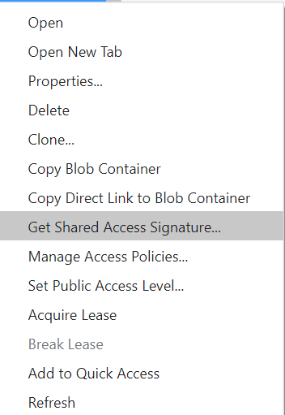

# Copy document from endpoint to SharePoint repository to reference from Sentinel
Please note that this is early proof of concept code so test and expand as needed for your scenario.
If you have more than one workspace and Geo, you will have to set this up separately if there is a requirement to keep information in Geo at rest.

## Prerequisites
- Complete setting up the other functions for the EndPoint event collection.
- Change he code of the function storing the endpoint events.
- Add a blob container to your existing function and retreive a SAS token for upload.

## Setup

1. Use [Azure Storage Explorer](https://azure.microsoft.com/en-us/features/storage-explorer/) to add an additional container.  

2. Create the container  
  

3. Create the Virtual Directory  
  

4. Generate the SAS token  
  

5. The SAS token should only have Write permissions nothing elese extend the life time as appropriate in this case it is until 2022    

6. Update the endpointscr.ps1 with the SAS token url, remember to modify the url to contain /endpoint/documents/$($name) default will be someblob.blob.core.windows.net/endpoint?....

7. Test the script on a single computer, note that only AccessByUnallowedApp, Print, FileCopiedToRemovableMedia, AccessByUnallowedApp, FileCopiedToNetworkShare will generate a copy. You can add or remove events by modifying line 34.

8. Deploy the script to run on a schedule with Task Scheduler or similar. https://docs.microsoft.com/en-us/archive/blogs/wincat/trigger-a-powershell-script-from-a-windows-event

9. Create a SharePoint Site Collection in Region with the appropriate retention time. Use a Records center template if you need to treat the information as records. See the SharePoint Online limits to determine if you need more than one collection per region. This will depend on your expected load and retention period. You can change the ingestion code to ingest information based on the Policy Name as an example to scale this out. **Create a Library named "Records"** in the newly created Site Collection.

10. [Click] Deploy to Azure above to deploy the logic app to copy from the Blob store to SharePoint.

11. Provide the right Resource Group, where the function app resides. You can move the function later. 

12. When deployed change the connections used for blob store as well as for SharePoint.

13. Update the function Store endpointDLPevents after line 129 add. Note that you can add the SPO site as a variable

     $origpath = "https://tenant.sharepoint.com/sites/DLPArchive/" + $user.PolicyMatchInfo.RuleId + "/" + $user.PolicyMatchInfo.policyid + "_" +  $user.PolicyMatchInfo.RuleId + "--" + $user.devicename + "-" + $user.DocumentName
    $user | Add-Member -MemberType NoteProperty -Name "originialContent" -value $origpath

### More information

+ **The scheduled event should monitor for event ID 1133 in Microsoft-Windows-Windows Defender/Operational, when the event is triggered it should execute. This need to be rolled out on the devices as part of task scheduler. You can also run it as a scheduled task.**  

- This is the script https://github.com/OfficeDev/O365-ActivityFeed-AzureFunction/blob/master/Sentinel/EndPointDLP_preview/DocumentCopy/endpointscr.ps1
- The script need to be signed to be trusted in the environment.
     - The script will pickup the events and check if they match the endpoint event format and filter.
     - On match it will make a copy of the document in TEMP to avoid locks
     - Upload the document in TEMP to the blob store defined in the Script.
     - Move the cursor up to date in the event log and remove the file in TEMP, if successful  
- **At this point the Logic App will trigger on the upload to Azure blob**
- The logic app monitors for changes in the Blob 
     - On trigger it will copy the Blob content to SharePoint Online
     - Remove the copy in the Azure Blob container  
          	
- **The Azure function used to enrich events to Azure Sentinel will add a link to the content. The link points to SPO.**

